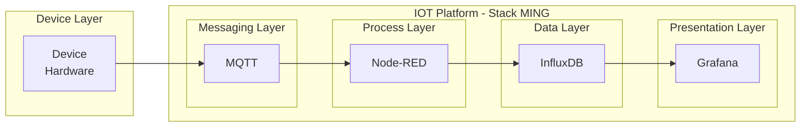
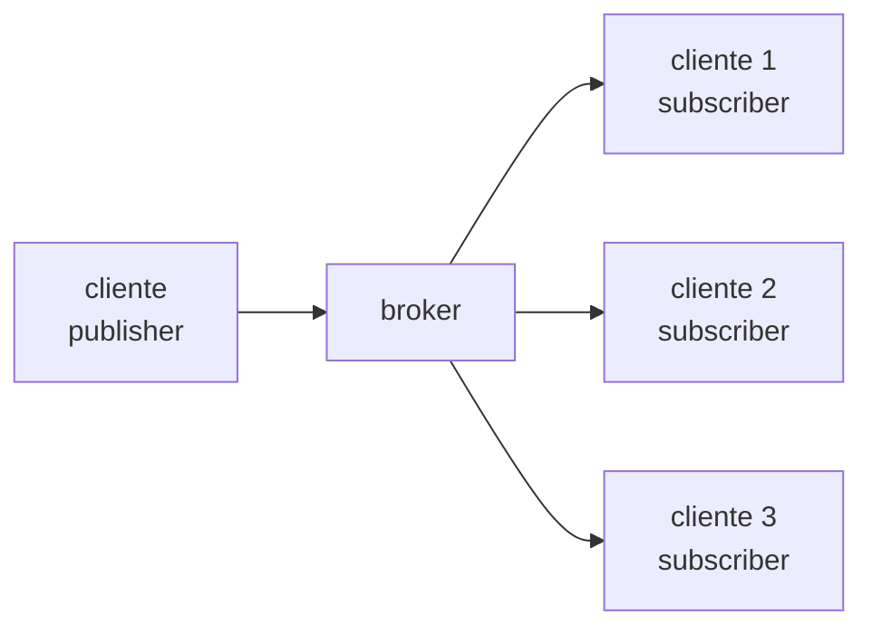

# Stack MING - Para uso em IIOT



A Stack **MING** é composta por quatro tecnologias principais utilizadas em arquiteturas de **IIoT (Industrial Internet of Things)**:

* **M – MQTT** → Comunicação entre dispositivos
* **I – InfluxDB** → Armazenamento de dados de sensores
* **N – Node-RED** → Processamento e integração dos dados
* **G – Grafana** → Visualização e monitoramento

O fluxo típico é:

**Dispositivo → MQTT → Node-RED → InfluxDB → Grafana**

---

# M - MQTT

## Message Queuing Telemetry Transport

Protocolo específico para comunicações IoT.

Diferente de protocolos como **HTTP**, que são considerados mais "custosos", o **MQTT** é um protocolo mais enxuto e eficiente para dispositivos com recursos limitados.

### Comunicação Assíncrona

O MQTT utiliza comunicação **assíncrona**, ou seja, não estabelece comunicação direta entre os clientes.

Por exemplo, o **Node-RED** não recebe os dados diretamente do dispositivo.

Na comunicação surge um dispositivo intermediário denominado **Broker**.

---

## Tipos de Clientes

Existem dois tipos principais de clientes no protocolo MQTT:

**Publisher**
Publica os dados no broker.

**Subscriber**
Recebe os dados publicados em um determinado tópico.

---

## Quality of Service (QoS)

O MQTT possui três níveis de garantia de entrega das mensagens.

**QoS 0 – no máximo uma vez**
("equivalente" ao UDP)

**QoS 1 – pelo menos uma vez**
Entrega garantida, porém podem ocorrer duplicações.

**QoS 2 – exatamente uma vez**
Entrega garantida sem duplicações, porém com maior sobrecarga.

---

## Tópicos

Os **tópicos** são "similares" ao conceito de **endpoints** e organizam as mensagens publicadas.

Exemplos de tópicos:

* `sensor/umidade/lab1`
* `sensor/umidade/lab2`
* `sensor/temperatura/lab1`

---

## Arquitetura de Comunicação MQTT



---

## Principais Softwares MQTT

* **HiveMQ** (em nuvem)
* **Eclipse Mosquitto** – execução em AWS EC2 ou Docker local

### Bibliotecas

* **Eclipse Paho**

---

# I - InfluxDB

O **InfluxDB** é um banco de dados **NoSQL (Not Only SQL)** especializado em **séries temporais**.

Seu foco principal é o **tempo (timestamp)**.

Um exemplo típico é armazenar a **variação da temperatura ao longo do tempo**, como:

* dia
* semanas
* meses

---

## Tipos de Bancos NoSQL

### Documentos – Exemplo: MongoDB

```json
{
    id: 1001
    cliente: "Carlos"
    endereço: {
        rua: nome da rua
        numero: numero
    }
    telefones: [
        {
            ddd: 15
            numero: 8182182182
        },
        {
            ddd: 15
            numero: 8182182182
        }
    ]
},
{
    id: 1002
    nome: "Fernanda"
}
```

---

### Chave-Valor – Exemplo: DynamoDB

```json
{
    "usuario:1001":"Carlos",
    "usuario:1002":"Fernanda",
    "usuario:1003":"Kevin"
}
```

---

## Estrutura de Dados no InfluxDB

Comparando com bancos relacionais:

* **Bucket** → equivalente ao banco de dados
* **Measurement** → equivalente à tabela

Dentro de um measurement temos:

**Timestamp**
Data e hora da medição.

**Campos**

* **Tags (indexados)**
  Descritivo do tipo chave-valor.

Exemplo:

```
sensor_id=1
sensor_id=2
```

* **Fields (não indexados)**
  Dados reais medidos.

Exemplo:

```
valor=23.5
status="ok"
```

---

# N - Node-RED

Ferramenta de programação **low-code baseada em fluxos (flow)**, desenvolvida originalmente pela **IBM** e atualmente parte da **OpenJS Foundation**.

---

## Funcionamento

O Node-RED trabalha com uma **interface visual baseada em nós (nodes)**.

Principais características:

* Baseado em **nós (nodes)**
* Arrastamos o nó para a tela
* Conectamos os nós formando os **fluxos (flows)**
* Cada nó possui suas próprias **configurações**

Tudo é feito por meio de uma **interface visual**.

---

# G - Grafana

Plataforma **open-source** para **visualização de dados, monitoramento e análise de métricas em tempo real**.

Principais características:

* **Dashboards interativos**
  ("lembra" ferramentas como Power BI)

* **Múltiplas fontes de dados**
  (InfluxDB, PostgreSQL, MySQL, Kubernetes, etc.)

* **Alertas inteligentes**
  Permite configurar alertas visuais.

* **Altamente escalável**
  Possui grande variedade de plugins.

* **Focado em séries temporais**


