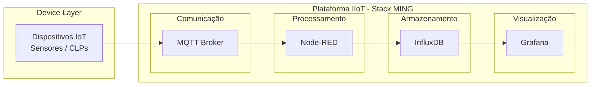
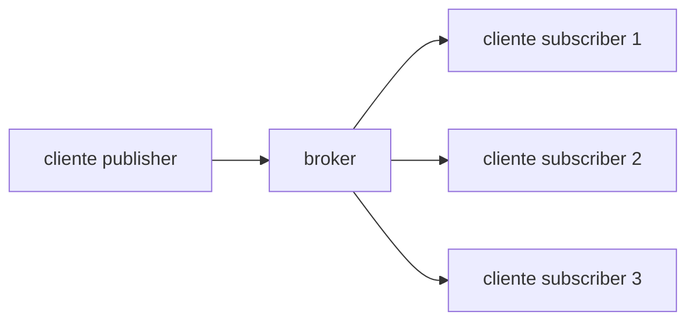

# Stack MING para uso em IIoT



A Stack MING é uma arquitetura utilizada em soluções de IIoT (Industrial Internet of Things) para coleta, processamento, armazenamento e visualização de dados provenientes de sensores e dispositivos industriais.
Ela organiza o sistema em camadas bem definidas, facilitando a integração entre tecnologias e permitindo que cada componente tenha uma responsabilidade específica dentro da solução.

O nome MING representa as quatro tecnologias principais utilizadas na arquitetura.

| Letra | Tecnologia | Função                                     |
| ----- | ---------- | ------------------------------------------ |
| M     | MQTT       | Comunicação entre dispositivos             |
| I     | InfluxDB   | Armazenamento de dados de séries temporais |
| N     | Node-RED   | Processamento e integração de dados        |
| G     | Grafana    | Visualização e monitoramento               |

Fluxo de dados da Stack

O fluxo típico de dados ocorre da seguinte forma:

Dispositivo → MQTT → Node-RED → InfluxDB → Grafana

Etapas do fluxo:

1. Dispositivos IoT coletam dados de sensores
2. Os dados são publicados em tópicos MQTT
3. Node-RED consome as mensagens do broker
4. Os dados são processados e transformados
5. As informações são armazenadas no InfluxDB
6. O Grafana consulta o banco de dados e exibe dashboards

Essa separação permite que o sistema seja modular e mais fácil de escalar.

M - MQTT

Message Queuing Telemetry Transport

O MQTT é um protocolo de comunicação leve, criado para funcionar bem em ambientes com pouca largura de banda, redes instáveis e dispositivos com baixo poder de processamento. Por esse motivo, é muito utilizado em projetos de IoT e IIoT.

Diferente do modelo tradicional utilizado em aplicações web, onde ocorre uma requisição direta entre cliente e servidor, o MQTT utiliza o modelo publish/subscribe.

Comunicação assíncrona

No MQTT os dispositivos não se comunicam diretamente entre si.
Todos os clientes se conectam a um broker MQTT, que atua como intermediário responsável por receber e distribuir as mensagens.

Esse modelo cria um ambiente desacoplado e escalável.

Broker MQTT

O broker é o servidor central da comunicação MQTT. Ele recebe mensagens dos dispositivos, identifica o tópico associado à mensagem e entrega essa informação para todos os clientes que estão inscritos naquele tópico.

Arquitetura simplificada:



Tipos de clientes MQTT

Existem dois papéis principais no protocolo.

Publisher

É o cliente responsável por enviar mensagens ao broker.

Exemplos:
sensor de temperatura
sensor de umidade
CLP industrial

Subscriber

É o cliente que se inscreve em um tópico para receber mensagens publicadas.

Exemplos:
Node-RED
sistemas de monitoramento
aplicações analíticas

Estrutura de tópicos

Os tópicos organizam as mensagens em uma estrutura hierárquica.

Exemplos:

```
sensor/temperatura/lab1
sensor/temperatura/lab2
sensor/umidade/lab1
sensor/luminosidade/lab1
```

Também é possível utilizar wildcards.

```
sensor/temperatura/+
sensor/#
```

Exemplo de payload MQTT

Um dispositivo pode enviar uma mensagem como esta:

```json
{
  "sensor_id": "sensor01",
  "temperatura": 24.5,
  "umidade": 62.1,
  "luminosidade": 310,
  "timestamp": "2026-03-16T19:45:00Z"
}
```

Essa mensagem poderia ser publicada no tópico:

```
sensor/lab1/leituras
```

Quality of Service (QoS)

O MQTT define níveis de garantia de entrega de mensagens.

QoS 0 — At most once
A mensagem é enviada apenas uma vez, sem confirmação de recebimento.
Possui menor latência, mas pode ocorrer perda de mensagens.

QoS 1 — At least once
A mensagem é reenviada até que o broker confirme o recebimento.
Garante entrega, porém pode ocorrer duplicação.

QoS 2 — Exactly once
Garante que a mensagem será entregue exatamente uma vez.
Possui maior confiabilidade, porém gera maior overhead e latência.

Principais brokers MQTT

Alguns brokers bastante utilizados em projetos de IoT são:

Eclipse Mosquitto
HiveMQ
EMQX
AWS IoT Core

Em ambientes educacionais e laboratoriais, o Mosquitto é muito utilizado por ser leve e fácil de executar em Docker ou servidores locais.

Bibliotecas MQTT

Algumas bibliotecas populares utilizadas no desenvolvimento de aplicações são:

Eclipse Paho
MQTT.js
paho-mqtt para Python

I - InfluxDB

O InfluxDB é um banco de dados NoSQL especializado em séries temporais.
Ele foi projetado para armazenar dados onde o tempo é um elemento fundamental da informação.

Exemplos de dados armazenados nesse tipo de banco:

temperatura
pressão
vibração
consumo de energia
telemetria de máquinas
métricas de sistemas

Tipos de bancos NoSQL

Existem diferentes categorias de bancos NoSQL utilizadas em sistemas modernos.

Documentos

Exemplo: MongoDB

A estrutura é baseada em documentos JSON.

```json
{
  "id": 1001,
  "cliente": "Carlos",
  "endereco": {
    "rua": "Rua das Flores",
    "numero": 120
  },
  "telefones": [
    {
      "ddd": 15,
      "numero": "98888-1111"
    }
  ]
}
```

Chave-valor

Exemplo: Redis ou DynamoDB

```json
{
  "usuario:1001": "Carlos",
  "usuario:1002": "Fernanda",
  "usuario:1003": "Kevin"
}
```

Séries temporais

Exemplos:

InfluxDB
TimescaleDB
Prometheus

Esses bancos são otimizados para consultas baseadas em tempo.

Estrutura de dados no InfluxDB

Os principais elementos utilizados são:

| Estrutura   | Equivalente aproximado em banco relacional |
| ----------- | ------------------------------------------ |
| Bucket      | Banco de dados                             |
| Measurement | Tabela                                     |
| Tag         | Coluna indexada                            |
| Field       | Coluna de dados                            |
| Timestamp   | Data e hora                                |

Measurement

Uma measurement representa um conjunto de medições relacionadas.

Exemplo:

sensores

Tags

As tags são campos utilizados para identificação e filtragem rápida dos dados.

Exemplo:

sensor_id = sensor01
local = laboratorio1

Fields

Os fields representam os valores medidos.

Exemplo:

temperatura = 24.5
umidade = 62.1
luminosidade = 310

Exemplo de registro no InfluxDB

Estrutura lógica:

measurement: sensores

tags:
sensor_id = sensor01
local = laboratorio1

fields:
temperatura = 24.5
umidade = 62.1
luminosidade = 310

timestamp:
2026-03-16T19:45:00Z

Exemplo de escrita via JSON

Em integrações com Node-RED ou APIs do InfluxDB, os dados podem ser enviados no seguinte formato:

```json
[
  {
    "measurement": "sensores",
    "tags": {
      "sensor_id": "sensor01",
      "local": "lab1"
    },
    "fields": {
      "temperatura": 24.5,
      "umidade": 62.1,
      "luminosidade": 310
    },
    "timestamp": "2026-03-16T19:45:00Z"
  }
]
```

N - Node-RED

O Node-RED é uma ferramenta de desenvolvimento baseada em fluxos, muito utilizada em integração de sistemas, automação e IoT.
Ele permite criar pipelines de dados de forma visual, conectando blocos chamados de nós.

Cada nó executa uma função específica, como:

leitura de dados via MQTT
transformação de mensagens
integração com APIs
armazenamento em banco de dados

O desenvolvedor constrói o fluxo conectando esses nós.

Exemplo de fluxo na Stack MING:

```
MQTT IN → JSON → FUNCTION → INFLUXDB OUT
```

Etapas:

MQTT IN
Recebe a mensagem enviada pelo dispositivo através do broker.

JSON
Converte o payload recebido para objeto estruturado.

FUNCTION
Realiza tratamento ou transformação dos dados.

INFLUXDB OUT
Armazena os dados no banco de séries temporais.

G - Grafana

O Grafana é uma plataforma open source voltada para visualização e monitoramento de dados.
Ele permite criar dashboards interativos que ajudam na análise de informações em tempo real.

Principais recursos

Dashboards com diferentes tipos de visualização:

gráficos de linha
indicadores
tabelas
mapas
alertas

Integração com múltiplas fontes de dados:

InfluxDB
PostgreSQL
MySQL
Prometheus
Elasticsearch

Alertas

O Grafana permite configurar alertas automáticos baseados em condições específicas, por exemplo:

temperatura acima de um limite
vibração fora do padrão
queda de comunicação de sensores

Integração com InfluxDB

O Grafana consulta o InfluxDB utilizando linguagens de consulta como InfluxQL ou Flux.

Exemplo de consulta:

```
from(bucket: "iot")
  |> range(start: -1h)
  |> filter(fn: (r) => r._measurement == "sensores")
```

Benefícios da Stack MING

Arquitetura modular
Tecnologias open source
Alta escalabilidade
Integração simples entre componentes
Adequada para prototipação rápida em IoT e IIoT
Facilidade de uso em ambientes educacionais e laboratoriais.
