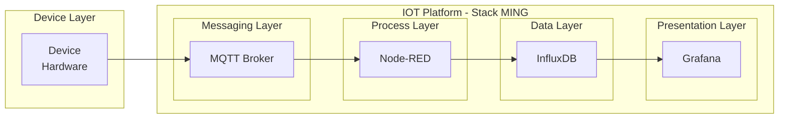
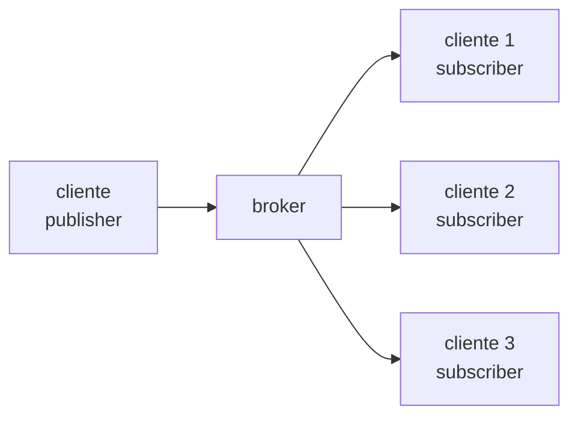

# Stack MING - Para uso em IIOT



A **Stack MING** é uma arquitetura amplamente utilizada em soluções de **IIoT (Industrial Internet of Things)** para coleta, processamento, armazenamento e visualização de dados provenientes de sensores e dispositivos industriais.

O nome **MING** representa as quatro tecnologias principais utilizadas na arquitetura:

| Letra | Tecnologia | Função                                     |
| ----- | ---------- | ------------------------------------------ |
| **M** | MQTT       | Comunicação entre dispositivos             |
| **I** | InfluxDB   | Armazenamento de dados de séries temporais |
| **N** | Node-RED   | Processamento e integração dos dados       |
| **G** | Grafana    | Visualização e monitoramento               |

---

# Fluxo de dados da Stack

O fluxo típico de dados ocorre da seguinte forma:

**Dispositivo → MQTT → Node-RED → InfluxDB → Grafana**

Etapas do fluxo:

1. **Dispositivos IoT** coletam dados de sensores
2. Os dados são **publicados em tópicos MQTT**
3. **Node-RED** consome os dados
4. Os dados são **processados e transformados**
5. Os dados são armazenados no **InfluxDB**
6. O **Grafana** consulta o banco e exibe dashboards

Essa arquitetura separa claramente as responsabilidades de cada componente.

---

# M - MQTT

## Message Queuing Telemetry Transport

O **MQTT** é um protocolo de comunicação extremamente leve, criado para ambientes com:

* **baixo consumo de energia**
* **baixa largura de banda**
* **redes instáveis**
* **dispositivos com poucos recursos**

Por isso ele é amplamente utilizado em **IoT e IIoT**.

Diferente do **HTTP**, que segue o modelo **request-response**, o MQTT utiliza o modelo **publish/subscribe**.

---

# Comunicação Assíncrona

No MQTT os dispositivos **não se comunicam diretamente**.

Todos os clientes se conectam a um **broker MQTT**, que é responsável por:

* receber mensagens
* filtrar mensagens
* entregar mensagens aos interessados

Isso cria um sistema **desacoplado e escalável**.

---

# Broker MQTT

O **Broker** é o servidor central responsável por:

* receber mensagens dos publishers
* identificar o tópico
* enviar a mensagem para todos os subscribers interessados

Arquitetura simplificada:



---

# Tipos de Clientes MQTT

Existem dois papéis principais:

## Publisher

Dispositivo que **publica mensagens** no broker.

Exemplo:

* sensor de temperatura
* sensor de umidade
* CLP industrial

---

## Subscriber

Cliente que **se inscreve em um tópico** para receber mensagens.

Exemplo:

* Node-RED
* Sistemas SCADA
* Aplicações analíticas

---

# Estrutura de Tópicos

Os **tópicos MQTT** organizam as mensagens em uma estrutura hierárquica.

Exemplos:

```
sensor/temperatura/lab1
sensor/temperatura/lab2
sensor/umidade/lab1
sensor/luminosidade/lab1
```

Também é possível utilizar **wildcards**:

```
sensor/temperatura/+
sensor/#
```

---

# Exemplo de Payload MQTT

Um sensor pode publicar a seguinte mensagem:

```json
{
  "sensor_id": "sensor01",
  "temperatura": 24.5,
  "umidade": 62.1,
  "luminosidade": 310,
  "timestamp": "2026-03-16T19:45:00Z"
}
```

Essa mensagem pode ser publicada no tópico:

```
sensor/lab1/leituras
```

---

# Quality of Service (QoS)

O MQTT define três níveis de garantia de entrega.

## QoS 0 — At most once

A mensagem é enviada **uma única vez**, sem confirmação.

Equivalente ao comportamento de **UDP**.

Vantagem:

* menor latência

Desvantagem:

* pode ocorrer perda de mensagem

---

## QoS 1 — At least once

A mensagem é enviada até que o broker confirme o recebimento.

Vantagem:

* entrega garantida

Desvantagem:

* pode haver duplicação de mensagens.

---

## QoS 2 — Exactly once

Garante que a mensagem será entregue **exatamente uma vez**.

Utiliza um protocolo de confirmação em quatro etapas.

Vantagem:

* máxima confiabilidade

Desvantagem:

* maior overhead e latência.

---

# Principais Brokers MQTT

Alguns dos brokers mais utilizados:

* **Eclipse Mosquitto**
* **HiveMQ**
* **EMQX**
* **AWS IoT Core**

O **Mosquitto** é muito utilizado em ambientes educacionais e laboratoriais por ser leve e fácil de executar em **Docker ou servidores locais**.

---

# Bibliotecas MQTT

Algumas bibliotecas populares:

* **Eclipse Paho**
* **MQTT.js**
* **Python paho-mqtt**

---

# I - InfluxDB

O **InfluxDB** é um banco de dados **NoSQL especializado em séries temporais (Time Series Database - TSDB)**.

Ele foi projetado para armazenar dados que possuem **tempo como dimensão principal**.

Exemplos de dados típicos:

* temperatura
* pressão
* vibração
* consumo energético
* métricas de servidores
* telemetria industrial

---

# Tipos de Bancos NoSQL

Existem vários tipos de bancos NoSQL.

---

# Documentos

Exemplo: **MongoDB**

Estrutura baseada em documentos JSON.

```json
{
  "id": 1001,
  "cliente": "Carlos",
  "endereco": {
    "rua": "Rua das Flores",
    "numero": 120
  },
  "telefones": [
    {
      "ddd": 15,
      "numero": "98888-1111"
    },
    {
      "ddd": 15,
      "numero": "97777-2222"
    }
  ]
}
```

Outro documento pode possuir estrutura diferente:

```json
{
  "id": 1002,
  "cliente": "Fernanda"
}
```

---

# Chave-Valor

Exemplo: **Amazon DynamoDB** ou **Redis**

```json
{
  "usuario:1001": "Carlos",
  "usuario:1002": "Fernanda",
  "usuario:1003": "Kevin"
}
```

---

# Séries Temporais

Exemplo:

* **InfluxDB**
* **TimescaleDB**
* **Prometheus**

Esses bancos são otimizados para consultas baseadas em **tempo**.

---

# Estrutura de Dados no InfluxDB

Os principais elementos do InfluxDB são:

| Estrutura   | Equivalente relacional  |
| ----------- | ----------------------- |
| Bucket      | Banco de dados          |
| Measurement | Tabela                  |
| Tag         | Coluna indexada         |
| Field       | Coluna de dados         |
| Timestamp   | Data e hora do registro |

---

# Measurement

Uma **measurement** representa um conjunto de medições.

Exemplo:

```
sensores
```

---

# Tags

As **tags** são campos indexados utilizados para **filtragem rápida**.

Exemplo:

```
sensor_id = sensor01
local = laboratorio1
```

---

# Fields

Os **fields** são os valores medidos.

Exemplo:

```
temperatura = 24.5
umidade = 62.1
luminosidade = 310
```

---

# Exemplo de Registro no InfluxDB

Estrutura lógica:

```
measurement: sensores

tags:
sensor_id = sensor01
local = laboratorio1

fields:
temperatura = 24.5
umidade = 62.1
luminosidade = 310

timestamp:
2026-03-16T19:45:00Z
```

---

# Exemplo de Escrita via JSON

No **Node-RED** ou APIs do InfluxDB é comum enviar os dados nesse formato:

```json
[
  {
    "measurement": "sensores",
    "tags": {
      "sensor_id": "sensor01",
      "local": "lab1"
    },
    "fields": {
      "temperatura": 24.5,
      "umidade": 62.1,
      "luminosidade": 310
    },
    "timestamp": "2026-03-16T19:45:00Z"
  }
]
```

---

# N - Node-RED

O **Node-RED** é uma ferramenta de programação **low-code baseada em fluxos (flow-based programming)**.

Foi criado originalmente pela **IBM** e atualmente é mantido pela **OpenJS Foundation**.

Ele é muito utilizado para:

* integração de sistemas
* automação
* IoT
* pipelines de dados

---

# Funcionamento

O Node-RED utiliza uma interface gráfica baseada em **nós (nodes)**.

Cada nó executa uma função específica, por exemplo:

* leitura MQTT
* transformação de dados
* chamada HTTP
* escrita em banco de dados

O desenvolvedor cria **fluxos (flows)** conectando os nós.

---

# Exemplo de Fluxo

Fluxo típico na stack MING:

```
MQTT IN → JSON → FUNCTION → INFLUXDB OUT
```

Etapas:

1. **MQTT IN**
   Recebe mensagem do broker.

2. **JSON**
   Converte payload para objeto.

3. **FUNCTION**
   Processa e organiza os dados.

4. **INFLUXDB OUT**
   Armazena no banco.

---

# G - Grafana

O **Grafana** é uma plataforma **open-source de observabilidade e visualização de dados**.

Ele permite criar **dashboards interativos** para análise de dados em tempo real.

---

# Principais Características

## Dashboards

Permite criar painéis com:

* gráficos de linha
* gauges
* mapas
* tabelas
* alertas

---

## Múltiplas Fontes de Dados

Grafana suporta diversos bancos:

* InfluxDB
* PostgreSQL
* MySQL
* Prometheus
* Elasticsearch

---

## Alertas

Permite configurar alertas automáticos, por exemplo:

* temperatura > 80°C
* vibração acima do limite

---

# Integração com InfluxDB

O Grafana consulta o InfluxDB usando:

* **InfluxQL**
* **Flux**

Exemplo de consulta:

```
from(bucket: "iot")
  |> range(start: -1h)
  |> filter(fn: (r) => r._measurement == "sensores")
```

---

# Benefícios da Stack MING

Principais vantagens:

* arquitetura **modular**
* tecnologias **open-source**
* alta **escalabilidade**
* integração simples
* ideal para **prototipação rápida em IoT**
